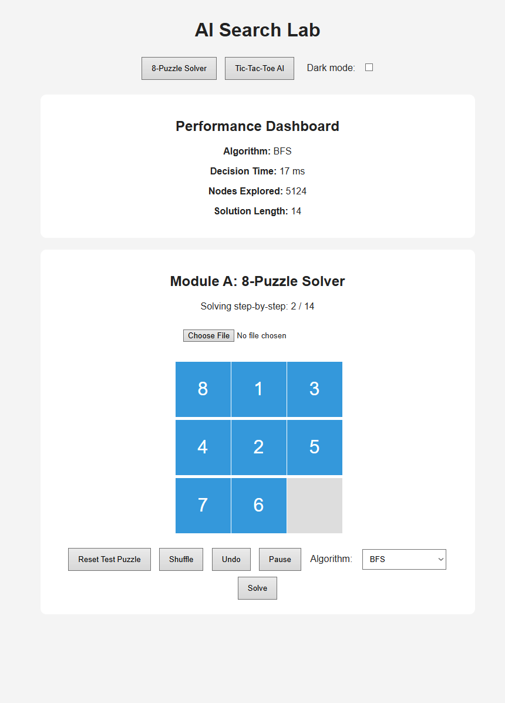
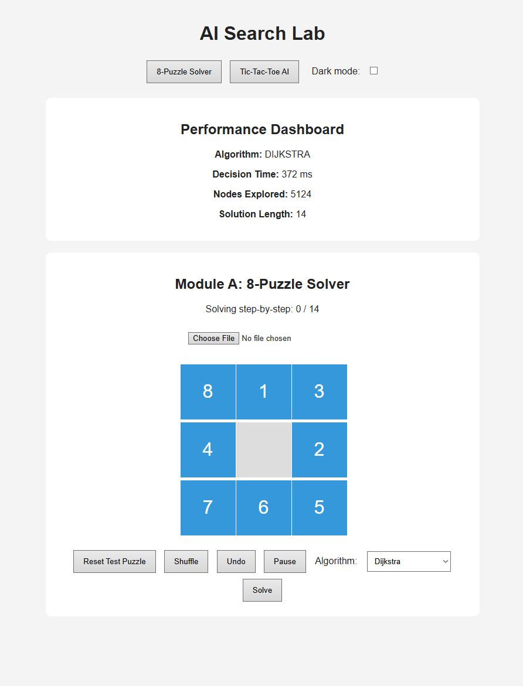
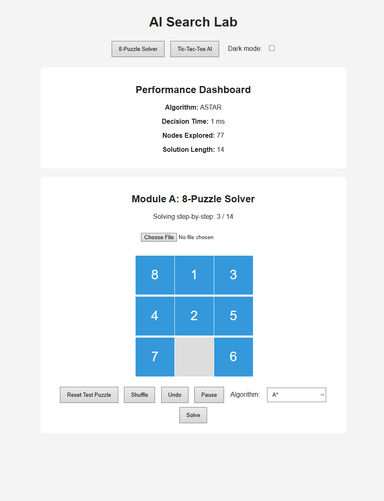
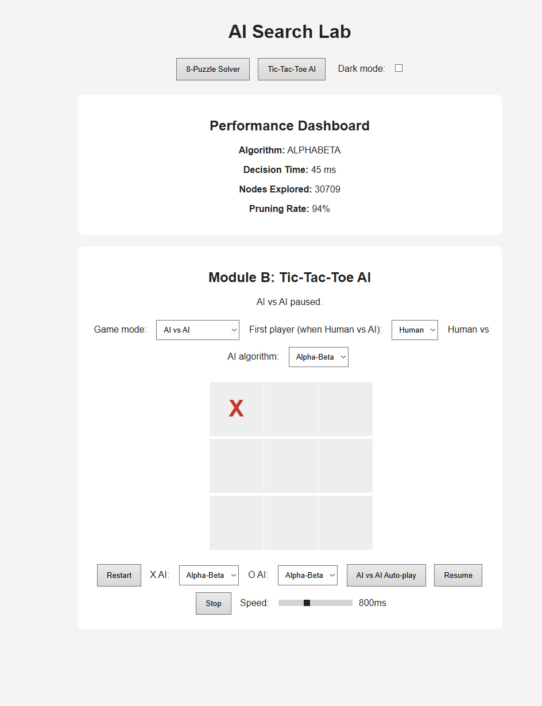

# AI Search Lab

## Overview

AI Search Lab is a single-page browser application with two connected modules:

- Module A: an 8-puzzle solver using BFS, Dijkstra, and A* search.
- Module B: Tic-Tac-Toe with Human vs Human, Human vs AI and AI vs AI modes using Minimax and Alpha-Beta Pruning.

The app includes a shared performance dashboard for decision time, nodes explored, solution length, and Alpha-Beta pruning rate.

## How to Run

Open `index.html` in any modern web browser. No installation, build step, server, or dependency setup is required.

The UI includes a Dark mode toggle in the navigation; the choice is persisted in `localStorage`.

## Architecture

- `index.html` contains the single entry point, navigation, module controls, puzzle board, tic-tac-toe board, and shared dashboard.
- `style.css` contains the page layout, board styling, tile feedback, and X/O visual distinction.
- `app.js` contains all search algorithms, state handling, animation, image upload/cropping, and dashboard updates.
- `screenshots/` contains dashboard evidence from the standardized test cases.

## Algorithms Implemented

- BFS: blind search for the 8-puzzle.
- Dijkstra: uniform-cost search for the 8-puzzle.
- A*: informed 8-puzzle search using Manhattan distance.
- Minimax: adversarial game-tree search for Tic-Tac-Toe.
- Alpha-Beta Pruning: Minimax with pruning to avoid unnecessary branches.

## Heuristic Justification

A* uses Manhattan distance. This heuristic adds up the number of grid moves each numbered tile is away from its goal position. Because one legal 8-puzzle move can move only one tile by one grid step, the true remaining cost can never be smaller than the Manhattan distance total, so the heuristic is admissible and does not overestimate.

## Dashboard Evidence

Module A standarized puzzle with BFS:

Module A standarized puzzle with Dijkstra:

Module A standardized puzzle with A*:

Module B standardized empty-board Alpha-Beta first move:

## Comparative Analysis

The 8-puzzle and Tic-Tac-Toe both create search spaces made of states and legal transitions, but the meaning of a transition is different. In the 8-puzzle, the program controls every move and searches for a path from one configuration to a fixed goal. In Tic-Tac-Toe, the search tree alternates between two players with competing goals, so a move is good only if it remains good after the opponent responds optimally.

A* fits the 8-puzzle because there is a clear destination state and a useful estimate of remaining distance. Manhattan distance helps A* prefer puzzle states that appear closer to the goal while still preserving optimality. A* does not directly fit Tic-Tac-Toe because there is no single target board to approach; the value of a board depends on future opponent choices. Minimax fits Tic-Tac-Toe because it models that opponent, but it does not naturally apply to the 8-puzzle because there is no adversary trying to make the puzzle worse.

On the standardized 8-puzzle start state `[[8,1,3],[4,0,2],[7,6,5]]`, all three solvers found the optimal 14-move solution. BFS expanded 5,124 nodes, Dijkstra expanded 5,124 nodes, and A* expanded 77 nodes. BFS and Dijkstra match here because every move has the same cost, so Dijkstra's priority queue behaves like level-order search. A* is much smaller because Manhattan distance gives it useful direction instead of forcing it to explore nearly every state at shallower depths.

On the standardized Tic-Tac-Toe test, empty board with AI first as X, Minimax explored 549,945 nodes for the first move. Alpha-Beta explored 30,709 nodes for the same first move, which means it avoided 519,236 nodes, or about 94% of the plain Minimax work. The selected first move can still lead to a draw with optimal play, but Alpha-Beta reaches that decision with far less search.

For trade-offs, BFS is complete and optimal for unit-cost moves, but its time and space grow exponentially by depth. Dijkstra is complete and optimal with nonnegative costs, but in this unit-cost puzzle it adds overhead without improving the result over BFS. A* is complete and optimal when using an admissible heuristic, and it can greatly reduce time and space, though it still may use a lot of memory on larger puzzles. Minimax is complete for finite games and optimal against an optimal opponent, but its time cost grows with the full game tree. Alpha-Beta returns the same optimal move as Minimax while reducing time through pruning, though its effectiveness depends on move ordering; it still has the same worst-case space pattern as depth-first Minimax.

## Credits

This project was created by Reymond Ortiz with assistance from ChatGPT and OpenAI Codex in Visual Studio Code for code generation, debugging, and development support.
